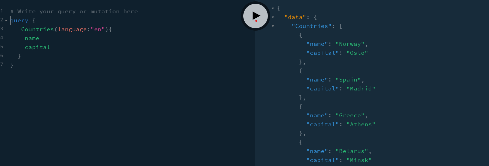

# Deploy link

https://gentle-ridge-12513.herokuapp.com/app/

## Server

Так как используется бесплатная версия Apollo Server то в качестве фотографии для аккаунта можно загрузить картинку размером не более 200кб

Cсылка на репозиторий сервера https://github.com/GlebLagutko/travelServer

Создана graphQL API и вот примеры запросов:

## Other

Чтобы ралогиниться надо нажать на картинку аккаунта.

Также написаны 10 юнит тестов
